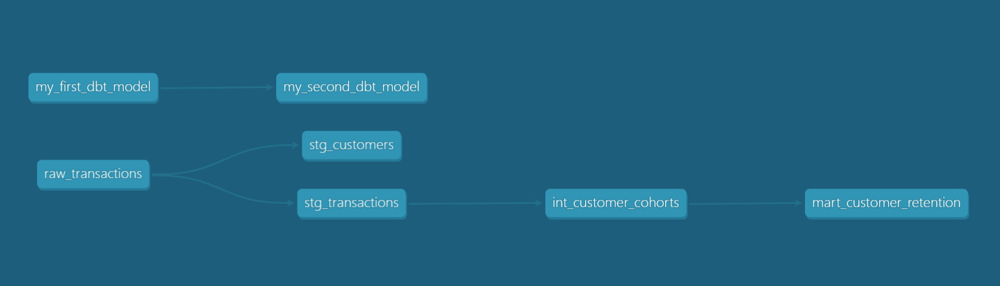

# dbt Retention Analytics Pipeline

**Analytics Engineering Portfolio Project**

Production-style dbt pipeline for cohort-based customer retention analysis.

**Stack:** dbt Core · DuckDB · dbt_utils

---

## Dataset

**E-commerce transactions** (synthetic):
- 1,000 transactions · 1,000 unique customers
- Date range: 2023-01 – 2024-01
- Fields: transaction_id, customer_id, date, product_category, quantity, price_per_unit, total_amount, gender, age

> **Note:** This seed represents a proof-of-concept dataset (1 transaction/customer).  
> In production, swap `raw_transactions` for a source table with repeat-purchase history to observe meaningful retention curves.

---

## Architecture

```
seeds/
└── raw_transactions.csv          # Source: denormalized e-commerce transactions

models/
├── staging/                      # Rename, type-cast, deduplicate — no business logic
│   ├── stg_customers.sql         # 1 row per customer (QUALIFY dedup)
│   ├── stg_transactions.sql      # 1 row per transaction
│   └── schema.yml                # Column docs + unique/not_null/relationships tests
│
├── intermediate/                 # Business logic: cohort assignment
│   ├── int_customer_cohorts.sql  # Transactions enriched with cohort_month & month_offset
│   └── schema.yml
│
└── mart/                         # Aggregated, BI-ready metrics (materialized: table)
    ├── mart_customer_retention.sql
    └── schema.yml
```

### Lineage



---

## Key Metrics — `mart_customer_retention`

| Column | Description |
|---|---|
| `cohort_month` | Month of first purchase |
| `month_offset` | Months since acquisition (0 = acquisition month) |
| `cohort_size` | Customers acquired in that month |
| `active_customers` | Customers still transacting at this offset |
| `retention_rate_pct` | `active / cohort_size * 100` |
| `churn_rate_pct` | `(1 - active / cohort_size) * 100` |

---

## Design Decisions

| Decision | Rationale |
|---|---|
| Monthly cohorts (`date_trunc`) | Daily cohorts produce cohort sizes of 1–2, making rates meaningless |
| `QUALIFY ROW_NUMBER()` in `stg_customers` | Deterministic dedup when customer attributes vary across transactions |
| `product_category` propagated to intermediate | Enables downstream category-level retention slices |
| Mart materialized as `table` | Retention queries scan the full dataset; pre-aggregation reduces BI tool latency |

---

## Data Quality Tests

Defined in `schema.yml` at every layer:

- **Staging:** `unique`, `not_null` on all PKs; `relationships` from `stg_transactions.customer_id` → `stg_customers`; `accepted_values` on `customer_gender`
- **Intermediate:** `unique` + `not_null` on all columns
- **Mart:** `not_null` on all output columns

---

## Getting Started

```bash
# Install packages
dbt deps

# Run all models
dbt run

# Run data quality tests
dbt test

# Run + test together
dbt build
```

---

## Next Steps

1. **LTV model** — cumulative revenue per cohort → CLTV prediction
2. **Category-level retention** — slice `mart_customer_retention` by `product_category`
3. **Experiment mart** — A/B test results table for retention intervention analysis
4. **Cloud migration** — Snowflake/BigQuery source swap (only `profiles.yml` change required)
