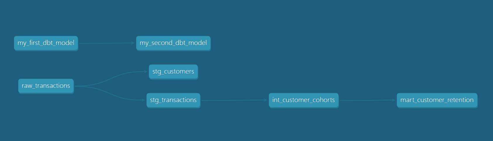

# dbt Retention Analytics Pipeline

**Analytics Engineering Portfolio Project** · **애널리틱스 엔지니어링 포트폴리오 프로젝트**

> 🌐 **Language / 언어** — Click a heading below to expand or collapse it. / 아래 제목을 클릭하면 펼치거나 접을 수 있습니다.

<details open>
<summary><h2>🇺🇸 English</h2></summary>

Production-style dbt pipeline for cohort-based customer retention analysis.

**Stack:** dbt Core · DuckDB · dbt_utils

---

### Dataset

**E-commerce transactions** (synthetic):
- 1,000 transactions · 1,000 unique customers
- Date range: 2023-01 – 2024-01
- Fields: transaction_id, customer_id, date, product_category, quantity, price_per_unit, total_amount, gender, age

> **Note:** This seed represents a proof-of-concept dataset (1 transaction/customer).
> In production, swap `raw_transactions` for a source table with repeat-purchase history to observe meaningful retention curves.

---

### Architecture

```
seeds/
└── raw_transactions.csv          # Source: denormalized e-commerce transactions

models/
├── staging/                      # Rename, type-cast, deduplicate — no business logic
│   ├── stg_customers.sql         # 1 row per customer (QUALIFY dedup)
│   ├── stg_transactions.sql      # 1 row per transaction
│   └── schema.yml                # Column docs + unique/not_null/relationships tests
│
├── intermediate/                 # Business logic: cohort assignment
│   ├── int_customer_cohorts.sql  # Transactions enriched with cohort_month & month_offset
│   └── schema.yml
│
└── mart/                         # Aggregated, BI-ready metrics (materialized: table)
    ├── mart_customer_retention.sql
    └── schema.yml
```

#### Lineage



---

### Key Metrics — `mart_customer_retention`

| Column | Description |
|---|---|
| `cohort_month` | Month of first purchase |
| `month_offset` | Months since acquisition (0 = acquisition month) |
| `cohort_size` | Customers acquired in that month |
| `active_customers` | Customers still transacting at this offset |
| `retention_rate_pct` | `active / cohort_size * 100` |
| `churn_rate_pct` | `(1 - active / cohort_size) * 100` |

---

### Design Decisions

| Decision | Rationale |
|---|---|
| Monthly cohorts (`date_trunc`) | Daily cohorts produce cohort sizes of 1–2, making rates meaningless |
| `QUALIFY ROW_NUMBER()` in `stg_customers` | Deterministic dedup when customer attributes vary across transactions |
| `product_category` propagated to intermediate | Enables downstream category-level retention slices |
| Mart materialized as `table` | Retention queries scan the full dataset; pre-aggregation reduces BI tool latency |

---

### Data Quality Tests

Defined in `schema.yml` at every layer:

- **Staging:** `unique`, `not_null` on all PKs; `relationships` from `stg_transactions.customer_id` → `stg_customers`; `accepted_values` on `customer_gender`
- **Intermediate:** `unique` + `not_null` on all columns
- **Mart:** `not_null` on all output columns

---

### Getting Started

```bash
# Install packages
dbt deps

# Load the seed data
dbt seed

# Run all models
dbt run

# Run data quality tests
dbt test

# Run + test together
dbt build
```

---

### Next Steps

1. **LTV model** — cumulative revenue per cohort → CLTV prediction
2. **Category-level retention** — slice `mart_customer_retention` by `product_category`
3. **Experiment mart** — A/B test results table for retention intervention analysis
4. **Cloud migration** — Snowflake/BigQuery source swap (only `profiles.yml` change required)

</details>

<details>
<summary><h2>🇰🇷 한국어</h2></summary>

코호트 기반 고객 리텐션 분석을 위한 프로덕션 스타일 dbt 파이프라인입니다.

**기술 스택:** dbt Core · DuckDB · dbt_utils

---

### 데이터셋

**이커머스 거래 데이터** (합성 데이터):
- 거래 1,000건 · 고유 고객 1,000명
- 기간: 2023-01 ~ 2024-01
- 컬럼: transaction_id, customer_id, date, product_category, quantity, price_per_unit, total_amount, gender, age

> **참고:** 이 시드 데이터는 개념 검증(PoC)용으로, 고객당 거래가 1건뿐입니다.
> 실제 운영 환경에서는 `raw_transactions`를 재구매 이력이 있는 소스 테이블로 교체해야 의미 있는 리텐션 곡선을 확인할 수 있습니다.

---

### 아키텍처

```
seeds/
└── raw_transactions.csv          # 소스: 비정규화된 이커머스 거래 데이터

models/
├── staging/                      # 컬럼명 정리, 타입 변환, 중복 제거 — 비즈니스 로직 없음
│   ├── stg_customers.sql         # 고객당 1행 (QUALIFY로 중복 제거)
│   ├── stg_transactions.sql      # 거래당 1행
│   └── schema.yml                # 컬럼 문서 + unique/not_null/relationships 테스트
│
├── intermediate/                 # 비즈니스 로직: 코호트 할당
│   ├── int_customer_cohorts.sql  # 거래에 cohort_month, month_offset 추가
│   └── schema.yml
│
└── mart/                         # 집계된 BI용 지표 (materialized: table)
    ├── mart_customer_retention.sql
    └── schema.yml
```

#### 리니지 (Lineage)


---

### 핵심 지표 — `mart_customer_retention`

| 컬럼 | 설명 |
|---|---|
| `cohort_month` | 첫 구매 월 |
| `month_offset` | 첫 구매 이후 경과 개월 수 (0 = 첫 구매 월) |
| `cohort_size` | 해당 월에 신규 획득한 고객 수 |
| `active_customers` | 해당 시점에도 구매 중인 고객 수 |
| `retention_rate_pct` | `active / cohort_size * 100` |
| `churn_rate_pct` | `(1 - active / cohort_size) * 100` |

---

### 설계 의사결정

| 결정 | 근거 |
|---|---|
| 월 단위 코호트 (`date_trunc`) | 일 단위 코호트는 규모가 1~2명에 그쳐 비율이 의미 없어짐 |
| `stg_customers`에서 `QUALIFY ROW_NUMBER()` 사용 | 거래마다 고객 속성이 다를 때도 결정적으로(deterministic) 중복 제거 |
| `product_category`를 intermediate까지 전달 | 카테고리별 리텐션 분석으로 확장 가능 |
| Mart를 `table`로 구체화 | 리텐션 쿼리는 전체 데이터를 스캔하므로, 사전 집계로 BI 도구 응답 속도 개선 |

---

### 데이터 품질 테스트

모든 레이어의 `schema.yml`에 정의되어 있습니다:

- **Staging:** 모든 PK에 `unique`, `not_null`; `stg_transactions.customer_id` → `stg_customers` 간 `relationships`; `customer_gender`에 `accepted_values`
- **Intermediate:** 전 컬럼 `unique` + `not_null`
- **Mart:** 모든 출력 컬럼 `not_null`

---

### 시작하기

```bash
# 패키지 설치
dbt deps

# 시드 데이터 로드
dbt seed

# 전체 모델 실행
dbt run

# 데이터 품질 테스트 실행
dbt test

# 실행 + 테스트 한 번에
dbt build
```

---

### 향후 계획

1. **LTV 모델** — 코호트별 누적 매출 → CLTV 예측
2. **카테고리별 리텐션** — `mart_customer_retention`을 `product_category`로 세분화
3. **실험 마트** — 리텐션 개선 A/B 테스트 결과 테이블
4. **클라우드 마이그레이션** — Snowflake/BigQuery로 전환 (`profiles.yml`만 변경)

</details>
